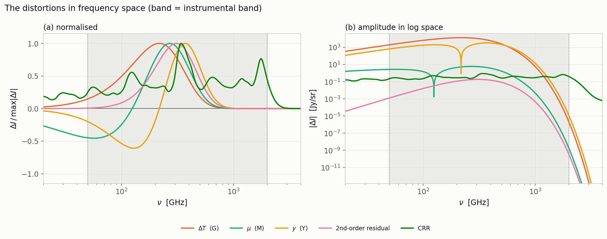
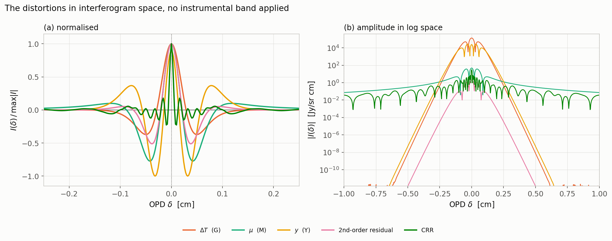

# Overview

The five basis shapes in frequency space, and the same five transformed
into interferogram space with no band applied.

The two line conventions, and how to read each of the three figure types, are
in the [atlas README](../../README.md). The δ statistics quoted below are
collected in the [summary table](../../README.md#the-numbers).

---

Before going component by component, here is everything on one pair of axes.

The five basis shapes — blackbody, ΔT, μ, y, the
second-order residual and CRR — against frequency, with the instrumental band shaded:
(a) each normalised to its own peak, so sign changes show; (b) at fiducial
amplitude, so the hierarchy shows.

The same five shapes transformed, with **no band
applied**: (a) each normalised to its own peak; (b) magnitude on a log
axis out to ±1 cm.

---

[← back to the atlas README](../../README.md) · [MODEL.md](../../MODEL.md)
