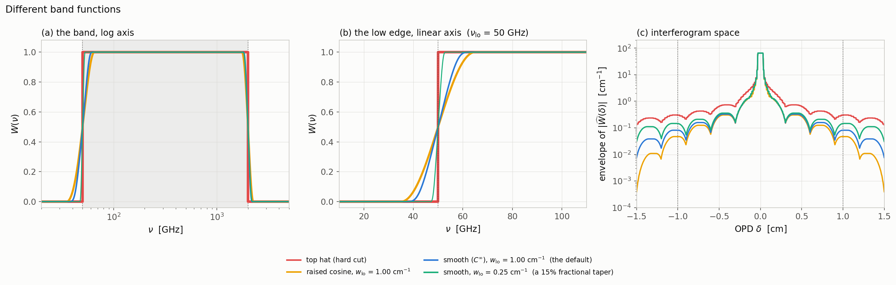

# The band

Here, different bands are studied. However, for every interferogram in the atlas only one window is used as described in [the model window](../../MODEL.md#the-window) 

The two line conventions, and how to read each of the three figure types, are
in the [atlas README](../../README.md). The δ statistics quoted below are
collected in the [summary table](../../README.md#the-numbers).

---

Four  band windows W(ν) ∈ [0,1] — a top hat, a raised cosine, the C∞ default, and a narrow 0.25 cm⁻¹ taper —
shown as (a) the whole band on a log frequency axis, (b) the low edge on a
**linear** axis, and (c) the envelope of their transforms against OPD, with the
carrier oscillation stripped off so the envelope can be read directly.

---

[← back to the atlas README](../../README.md) · [MODEL.md](../../MODEL.md)
