# The distortions

The six components of the distortion basis, three figures each: the blackbody (as a check),
the temperature shift ΔT, the chemical potential μ, Compton-y, the second-order
temperature residual, and the cosmological recombination radiation. The horizontal dashed line represents the noise, as described in [white noise](../../MODEL.md#noise)

The two line conventions, and how to read each of the three figure types, are
in the [atlas README](../../README.md). The δ statistics quoted below are
collected in the [summary table](../../README.md#the-numbers).

---

## Simple check: the blackbody

Not a distortion, considered a test

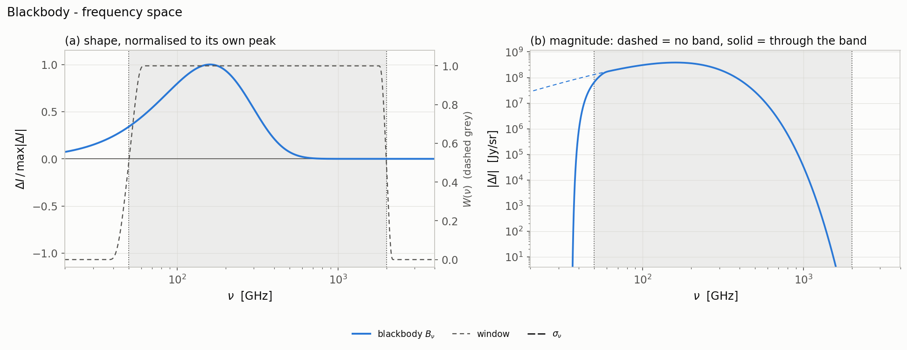

The CMB blackbody Bν against frequency:
(a) normalised to its own peak with the instrument band over it, (b) absolute
magnitude in Jy/sr, dashed = no band, solid = through the band.

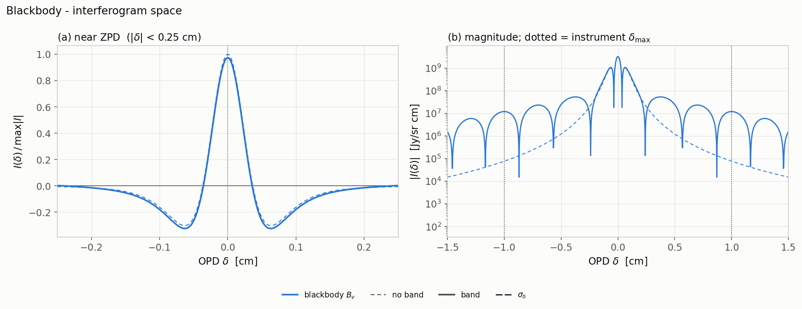

The blackbody interferogram: (a) near ZPD,
normalised to the unbanded peak, (b) magnitude out to ±1.5 cm with
±δmax marked.

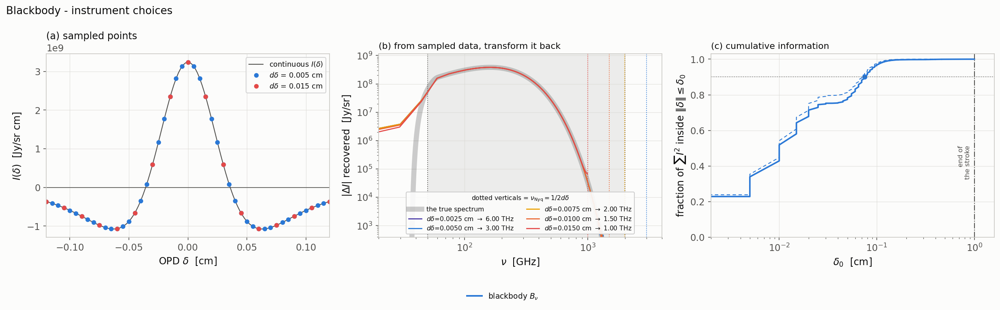

(a) the continuous interferogram with the samples
two dδ choices would take, (b) the round trip through each dδ, (c) cumulative
information against threshold δ0.

## Temperature shift, ΔT (the G spectrum)

$G(x) = x^4\frac{e^x}{(e^x-1)^2}$, 
the shape of a pure temperature shift, at ΔT/T = 10⁻⁵.

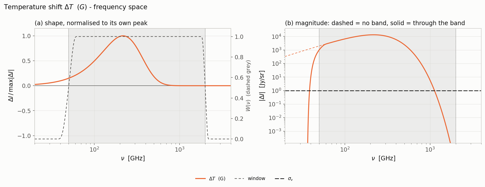

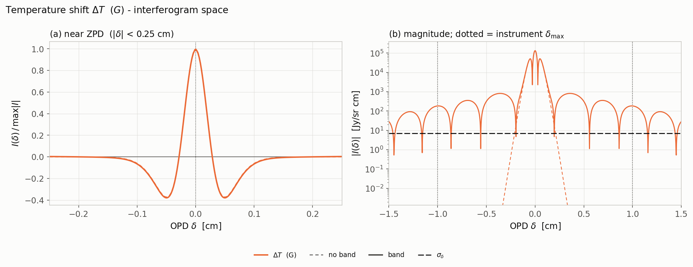

The G interferogram, unbanded (dashed) and through
the band (solid).

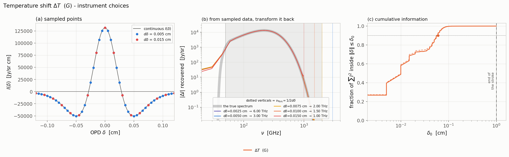

The three instrument panels for ΔT.

## Chemical potential, μ (the M spectrum)

M(x) = G(x)(αμ - 1/x), the chemical-
potential shape. $\mu=2\times 10^{8}$

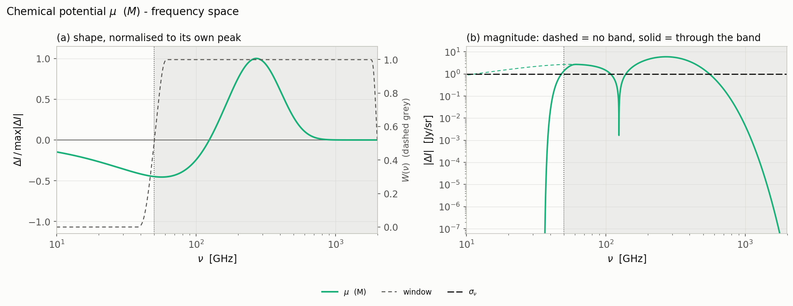

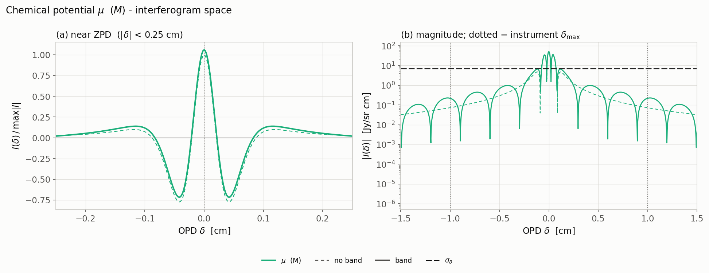

The M interferogram, unbanded and banded.

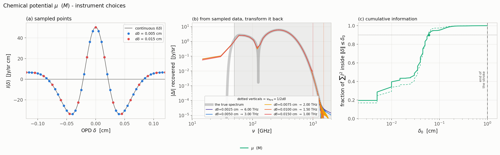

The three instrument panels for μ.

## Compton-y (the Y spectrum)

$Y(x) = G(x)(x \coth(\frac{x}{2}) - 4)$ with $y = 1.77\times 10^{-6}$

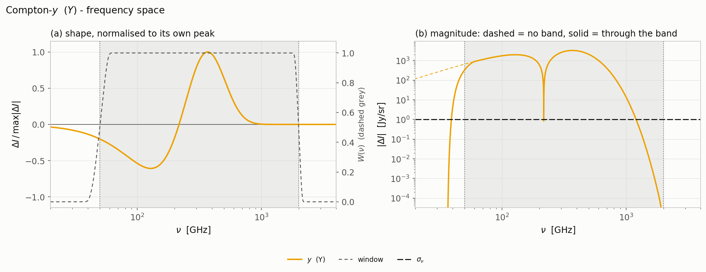

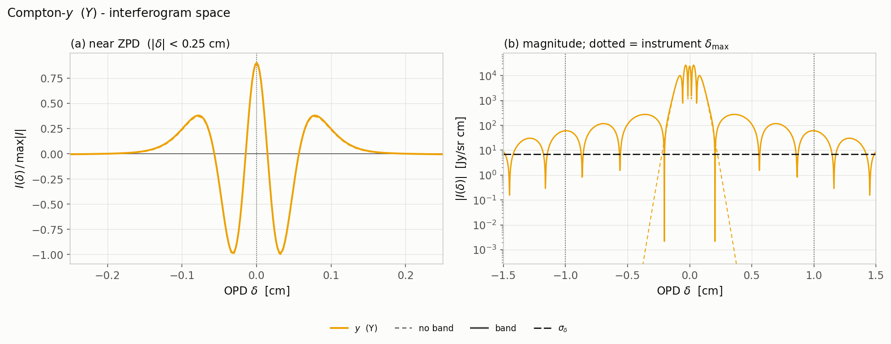

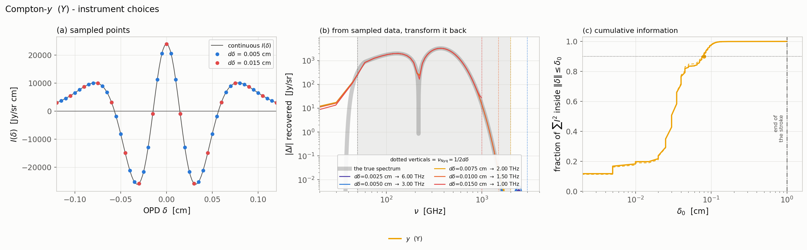

The three instrument panels for y.

## Second-order temperature residual

What is left of a temperature shift, $\frac{\Delta T}{T}^2(G + \frac{1}{2}Y)$, after the linear piece has
been absorbed into the calibration.

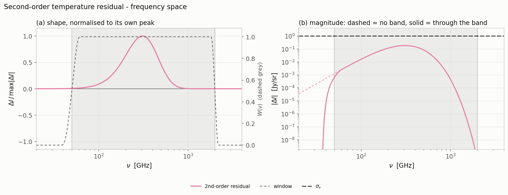

Completely below the noise level

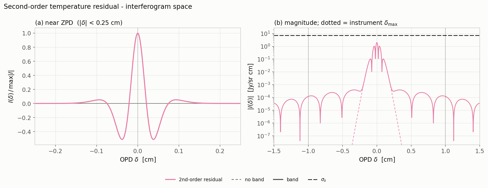

The residual's interferogram, unbanded and banded.

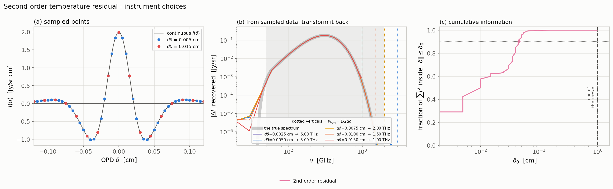

The three instrument panels for the residual.

## Cosmological recombination radiation

The CRR line forest, from the Taylor tables.

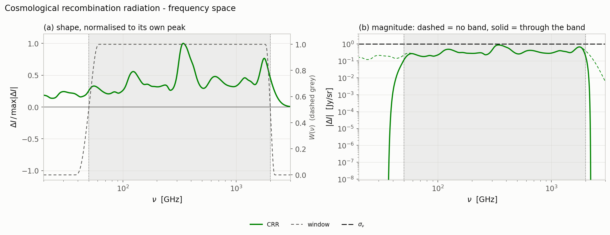

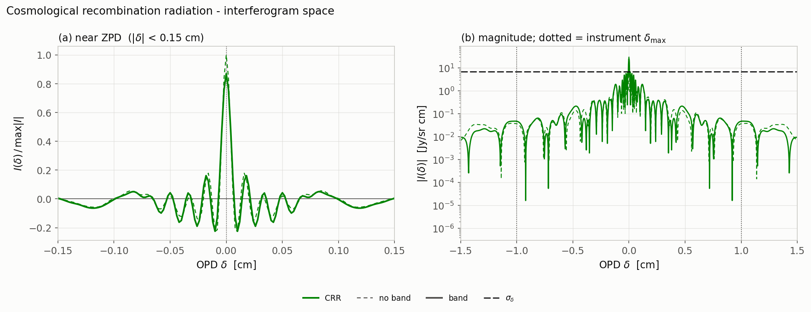

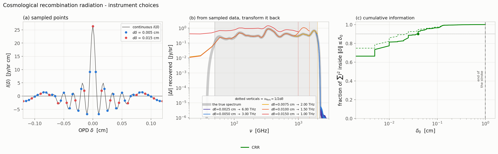

The three instrument panels for CRR.

---

[← back to the atlas README](../../README.md) · [MODEL.md](../../MODEL.md)
