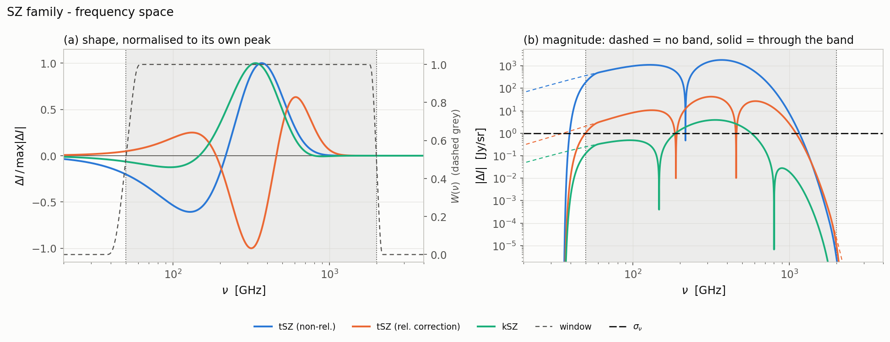
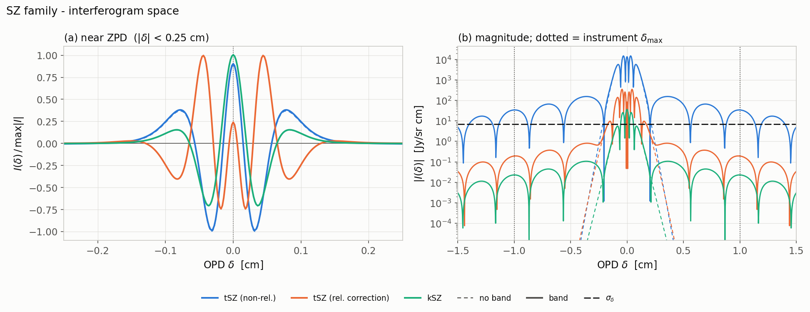
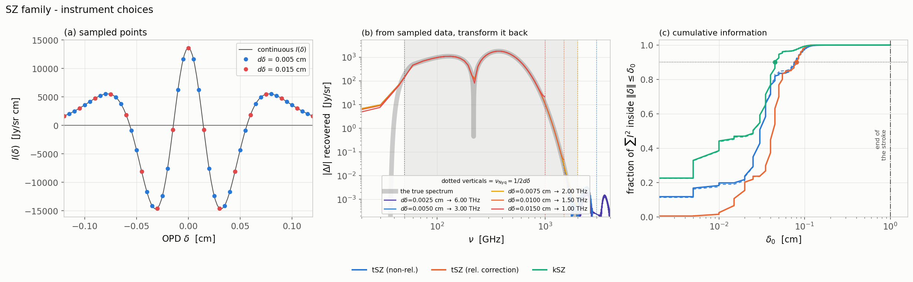
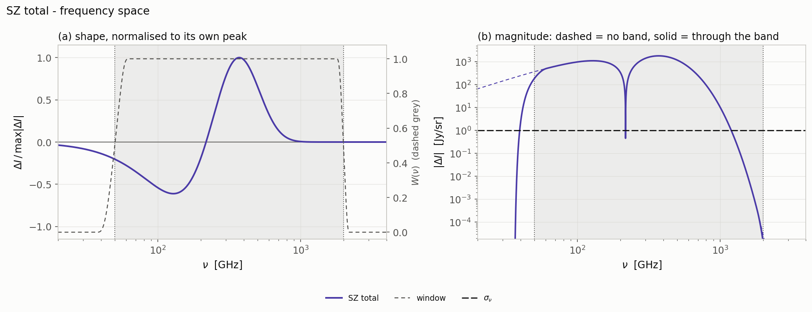
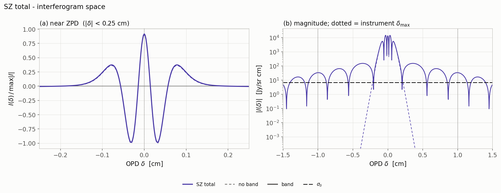
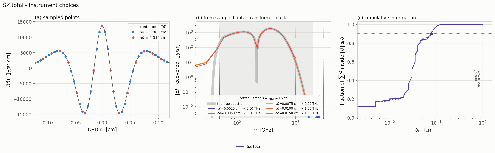

# The SZ family

The Sunyaev–Zel'dovich terms, three figures each: first the three terms
together — non-relativistic tSZ, its relativistic correction, and kSZ — then
their sum.

The two line conventions, and how to read each of the three figure types, are
in the [atlas README](../../README.md). The δ statistics quoted below are
collected in the [summary table](../../README.md#the-numbers).

---

## The SZ family, together

The three SZ terms on the same axes: the non-relativistic thermal SZ, its
relativistic correction, and the kinematic SZ. All at Δτ = 3.93×10⁻⁴,
Te = 1300 eV, β = 1/300, giving θe = 2.5440×10⁻³ and
ytSZ = 9.9981×10⁻⁷.

The three instrument panels, with panel (a) and (b) showing the sum of all the SZ components, while (c) carrying
one curve per SZ term.

## The SZ total

The sum of the three.

The summed SZ interferogram.

The three instrument panels for the SZ total.

---

[← back to the atlas README](../../README.md) · [MODEL.md](../../MODEL.md)
