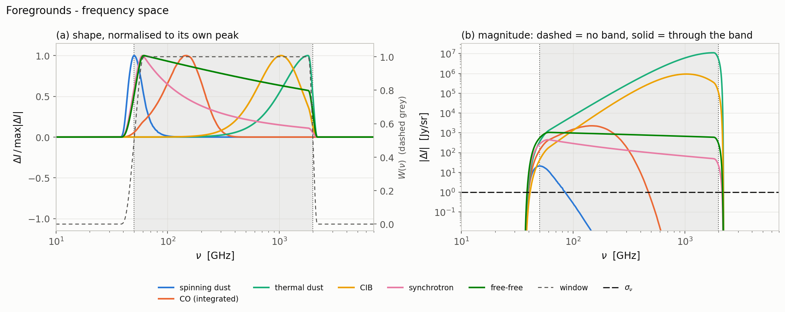
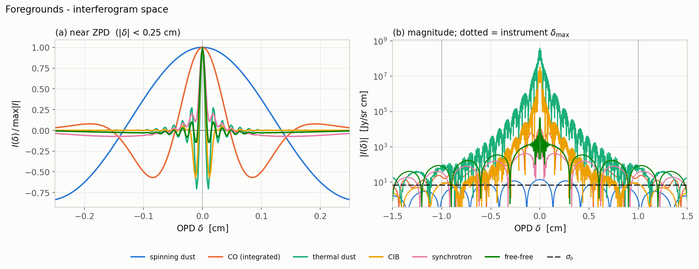
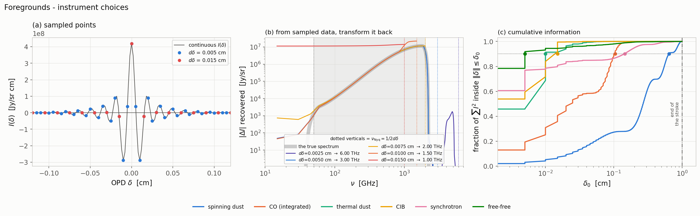
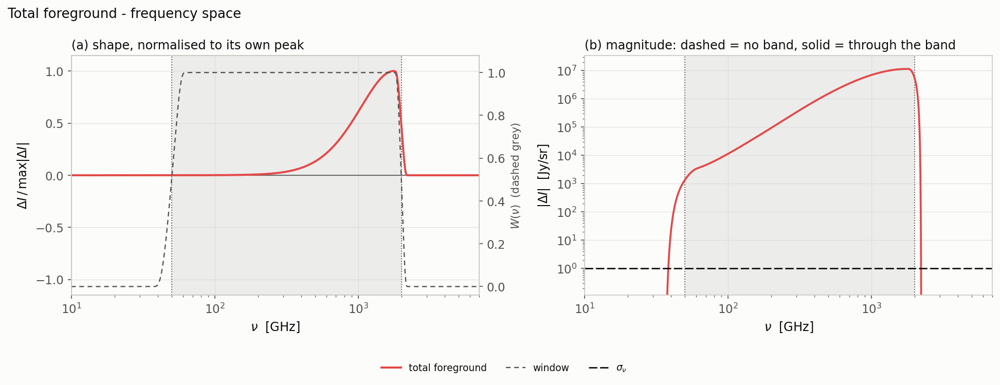
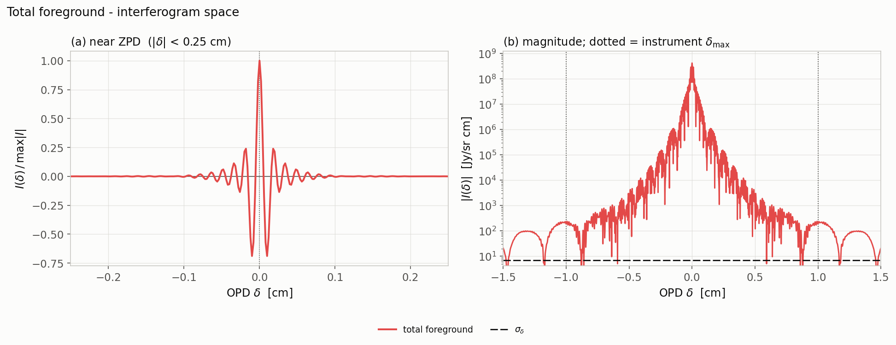
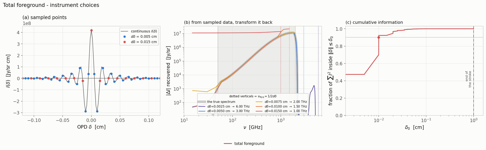

# The foregrounds

The six Galactic and extragalactic foregrounds, three figures each: first all
six together, then their sum. From here on only the windowed version is shown.

The two line conventions, and how to read each of the three figure types, are
in the [atlas README](../../README.md). The δ statistics quoted below are
collected in the [summary table](../../README.md#the-numbers).

---

## The foregrounds, together

**From here on only the windowed version is shown** — the window is applied
directly. Thermal dust and the CIB are still bright at the
end of the grid, so an "unbanded" foreground
interferogram would be showing the edge of the grid, not the sky. The
distortions have no such problem, which is why they get both curves.

The three instrument panels, with panel (a) and (b) showing the sum of the foregrounds while (c) carrying
one curve per foreground.

## The total foreground

The sum of all six foregrounds through the window.

The summed foreground interferogram, banded.

 The three instrument panels for the total foreground.

---

[← back to the atlas README](../../README.md) · [MODEL.md](../../MODEL.md)
