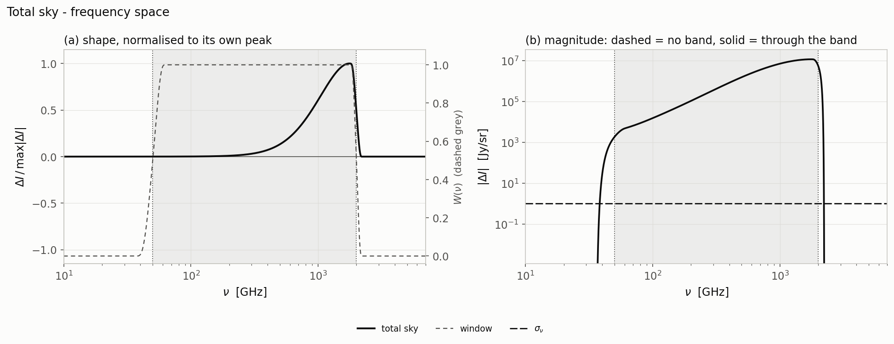
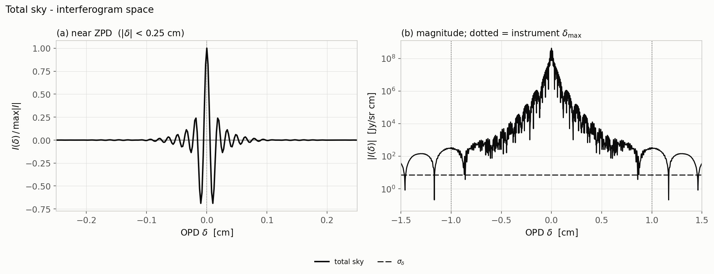
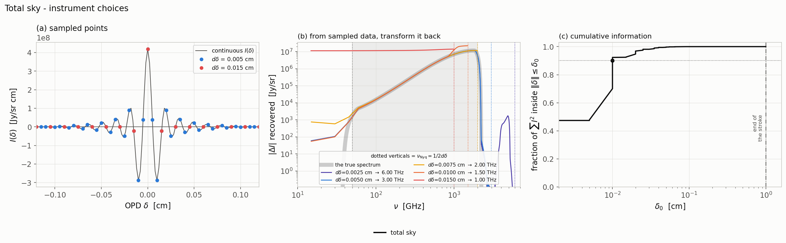
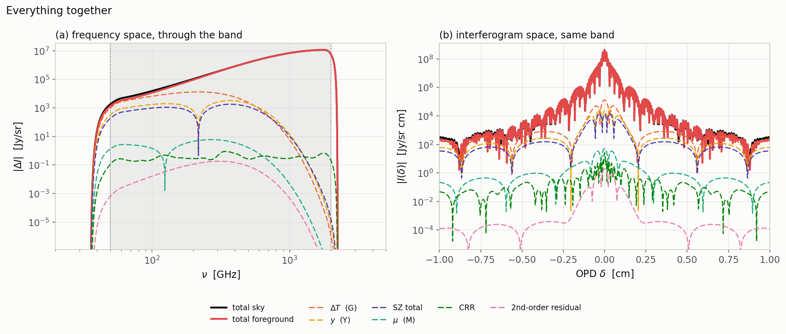

# The totals

Summing together all distortions plus all foregrounds,
through the instrument band — in three figures, followed by a single overlay putting
the full hierarchy on one pair of axes.

The two line conventions, and how to read each of the three figure types, are
in the [atlas README](../../README.md). The δ statistics quoted below are
collected in the [summary table](../../README.md#the-numbers).

---

## The total sky

Everything at once:  all distortions + all foregrounds, through the
instrument band.

The summed sky spectrum through the window.

 The total sky interferogram, banded.

The three instrument panels for the total sky.

## The hierarchy

The total sky and total foreground (solid) overlaid
on the individual distortions (dashed), in (a) frequency space and (b)
interferogram space, both through the instrument band.

---

[← back to the atlas README](../../README.md) · [MODEL.md](../../MODEL.md)
