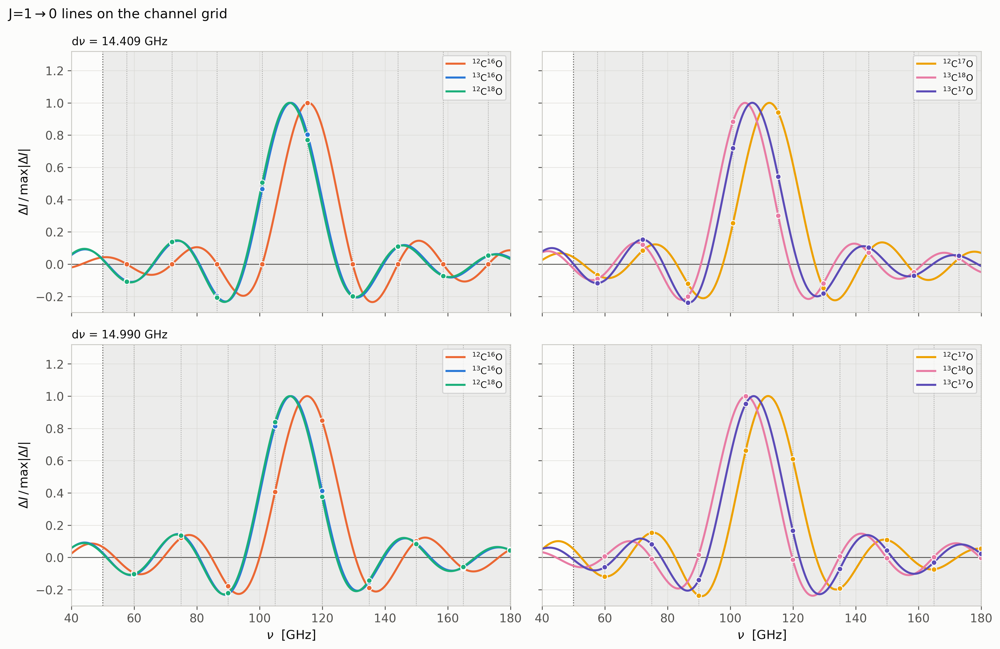
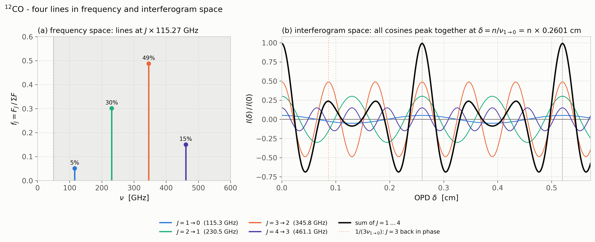
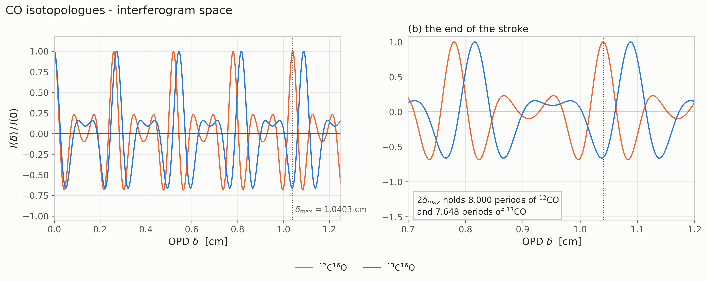
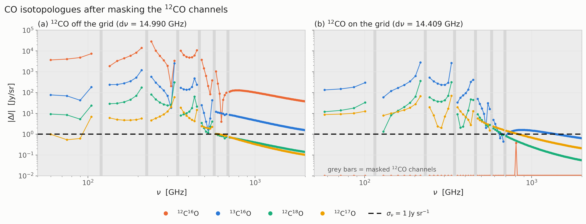
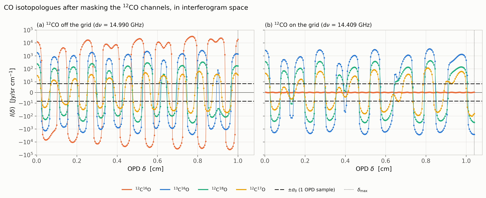

# CO isotopologues and the channel grid

Can the channel spacing be chosen so that CO drops out of the spectrum, and how
much do the CO isotopologues "mess" it up?

---

## Model

In the model used here, the 12CO rotational lines form an exactly
evenly spaced ladder, νJ = J × 115.27 GHz.

If the channel spacing is dν = 115.27/8 = 14.41 GHz, every 12CO line lands on a channel centre that can be masked. In this case we have not used a window.

The isotopologue ladders are spaced by their own emission, so they **do not** land on that grid, and they leak into every channel.

---

## Assumptions

Every one of these is a deliberate simplification.

1. **Rigid rotor.** Lines at νJ = 2BJ. 
2. **Lines are delta functions.**
3. **Local Thermodynamic Equilibrium (LTE) at a single excitation temperature** Tex for every level of every species.
4. **One velocity profile for all lines**, flat-topped (a box) of width Δv.
5. **Same column, same line width and same dipole moment for all species.** The
   isotopologues differ from 12CO only through B and a fixed
   abundance X. 

---

## The numbers

### Physical parameters

| quantity | symbol | value |
|---|---|---|
| 12CO(1→0) integrated intensity | WCO | 1 K km/s |
| 12CO(1→0) optical depth | τ0 | 3 (diffuse / translucent gas) |
| excitation temperature | Tex | 7 K |
| isotope ratios | 12C/13C, 16O/18O, 18O/17O | 68, 557, 3.6 |

### Species

B from laboratory spectroscopy (CDMS). X = abundance relative to
12C16O. Q = partition function at 7 K. **X and Q values to be double checked.**

| species | B [MHz] | X | ν(1→0) [GHz] | Q |
|---|---|---|---|---|
| 12C16O | 57635.968 | 1 | 115.2719 | 2.893 |
| 13C16O | 55101.011 | 1/68 | 110.2020 | 3.008 |
| 12C18O | 54891.420 | 1/557 | 109.7828 | 3.018 |
| 12C17O | 56179.990 | 1/(557 × 3.6) = 1/2005 | 112.3600 | 2.957 |
| 13C18O | 52356.001 | 1/(68 × 557) = 1/37876 | 104.7120 | 3.145 |
| 13C17O | 53644.791 | 1/(68 × 557 × 3.6) = 1/136354 | 107.2896 | 3.079 |

---

## The equations

**(1) Line positions.** For the line from upper level J to J − 1 of a rigid rotor,

$$\nu_J = 2BJ, \qquad E_J = hB\,J(J+1).$$

**(2) Spectrum.** A sum of delta functions with the integrated flux FJ,

$$S(\nu)=\sum_J F_J\,\delta_D(\nu-\nu_J)\qquad[\mathrm{Jy\,sr^{-1}}].$$

**(3) Interferogram.** The FTS measurement equation gives

$$I(\delta)=\int_0^\infty S(\nu)\cos(2\pi\nu\delta)\,d\nu=\sum_J F_J\cos(2\pi\nu_J\delta).$$

**(4) Recovered spectrum.** Trapezoid-weighted cosine transform of the samples:

$$\tilde S(\nu)=2\,d\delta\sum_{n=-M}^{M}w_n\,I(\delta_n)\cos(2\pi\nu\delta_n),
\qquad w_{\pm M}=\tfrac12,\ w_n=1\ \text{otherwise}.$$

---

## The J = 1→0 lines on the channel grid

Each curve is normalised to its own peak. The dots are the same function at the
in-band channel centres νk (faint dotted verticals), i.e. the only
numbers the instrument delivers. The area coloured is the instrumental band.

* **Top row, 115.27/8 grid** (dν = 14.409 GHz, dδ = 0.00500 cm,
  δmax = 1.0403 cm). 12CO sits on channel 8. Its dot there is 1 and every other dot is exactly 0.
* **Bottom row, slightly different grid** (dν = 14.990 GHz, dδ = 0.00500 cm,
  δmax = 1.0000 cm). Now 12CO is off the grid too and leaks like the others.

13CO and C18O almost overlap, because their B differ by
only 0.4%.

---

## Lines in the interferogram space

**(a)** The four 12CO as fractions fJ = FJ/ΣF of the whole ladder. **(b)** Each line becomes one cosine fJ cos(2πJν1→0δ), with period 1/(Jν1→0). The black curve is their sum.

**(a)** I(δ)/I(0)  summed over every line below 2 THz: J = 1…10 for 12CO and J = 1…9 for 13CO. It is evaluated continuously on a fine OPD grid, not at the instrument samples.  **(b)** The end of the stroke.

---

## What lands in the channels, after masking the 12CO channels

### In frequency space

The grey bars are the six masked 12CO channels (J = 1…6):

The dashed line is σν.

* **(a) Off grid.** 12CO is off the grid.
* **(b) 115.27/8 grid.** Every 12CO line is exactly on a channel, so
  masking those six channels removes it completely. The only
  12CO point left is the J = 7→6 line at 806.9 GHz. It is on the
  grid but, at F/dν = 0.38 Jy/sr, fainter than σν, so it is not
  masked. The isotopologues are unchanged: 13CO at 10²–3×10³ Jy/sr
  below 350 GHz, C18O and C17O at 10–300. Above ~700 GHz
  everything is at or below σν.

### In interferogram space

The unmasked in-band channel values of the figure above, transformed back to the
OPD samples the instrument records.

* **(a) Off grid.** An off-grid 12CO line differs from its
  nearest channel's cosine by a phase that drifts linearly.
* **(b) 115.27/8 grid.** Each on-grid line matches its channel's cosine along
  the whole stroke, so masking removes it.

---

[← back to the atlas README](../../README.md) · [MODEL.md](../../MODEL.md)
